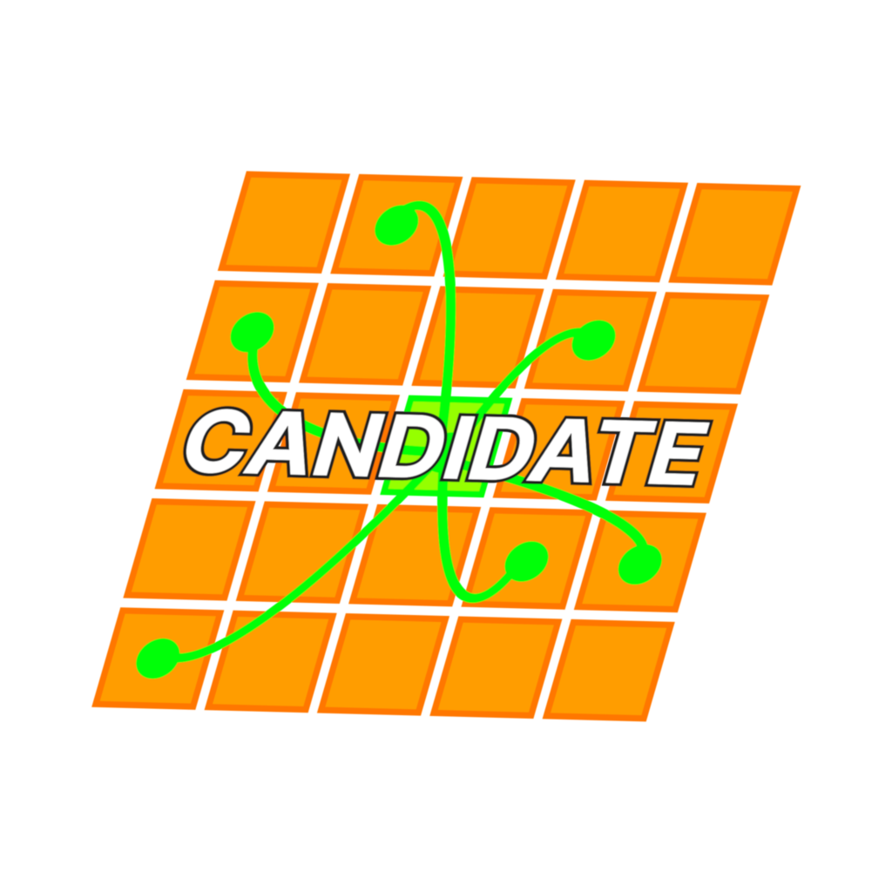
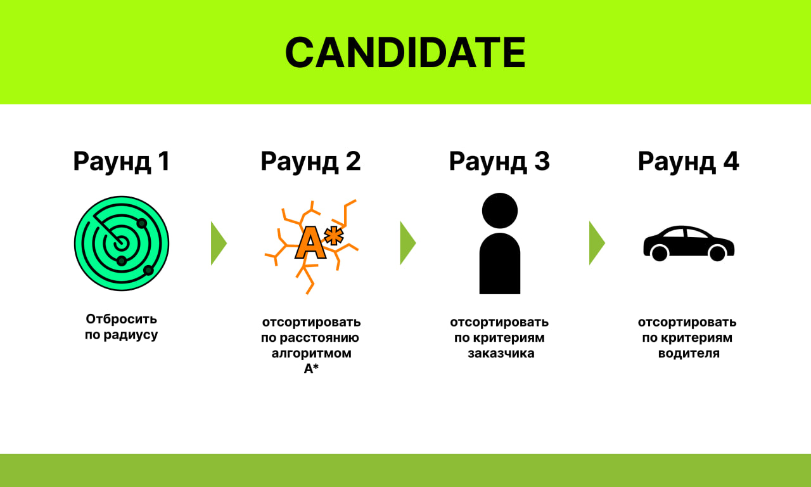

  

<h1>CANDIDATE - Система подбора такси</h1>
Четырех-раундовый алгоритм поиска идельного водителя к заказу.
Первые два раунда отфильтровывают по радиусу и вычисляют расстояние до клиента и от
клиента до конечной точки.
Третий и четвертый раунды анализируют и выбирают водителя при схождении критериев
клиента и водителя.

  

